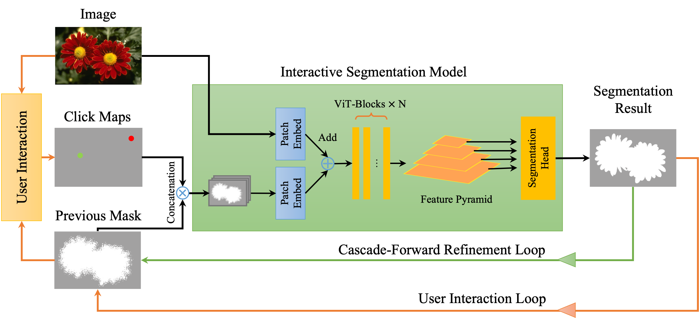

## CFR-ICL: Cascade-Forward Refinement with Iterative Click Loss for Interactive Image Segmentation

<p align="center">
  
</p>

## Environment
Training and evaluation environment: Python 3.9, PyTorch 1.13.1, CUDA 11.0. Run the following command to install required packages.
```
pip3 install -r requirements.txt
```

You need to configue the paths to the datasets in `config.yml` before training or testing. A script `download_datasets.sh` is prepared to download and organize required datasets.

## Demo
<p align="center">
  
</p>

An example script to run the demo. 
```
python demo.py --checkpoint=weights/cocolvis_icl_vit_huge.pth --gpu 0
```

## Evaluation

Before evaluation, please download the datasets and models, and then configure the path in `config.yml`.

Download our model, please download below 3 zipped files and extract before use:

- [cocolvis_icl_vit_huge.pth.7z.001](https://github.com/TitorX/CFR-ICL-Interactive-Segmentation/releases/download/v1.0/cocolvis_icl_vit_huge.pth.7z.001)
- [cocolvis_icl_vit_huge.pth.7z.002](https://github.com/TitorX/CFR-ICL-Interactive-Segmentation/releases/download/v1.0/cocolvis_icl_vit_huge.pth.7z.002)
- [cocolvis_icl_vit_huge.pth.7z.003](https://github.com/TitorX/CFR-ICL-Interactive-Segmentation/releases/download/v1.0/cocolvis_icl_vit_huge.pth.7z.003)


Use the following code to evaluate the huge model.

```
python scripts/evaluate_model.py NoBRS \
    --gpu=0 \
    --checkpoint=cocolvis_icl_vit_huge.pth \
    --datasets=GrabCut,Berkeley,DAVIS,PascalVOC,SBD \\
    --cf-n=4 \\
    --acf

# cf-n: CFR steps
# acf: adaptive CFR
```

## Training

Before training, please download the [MAE](https://github.com/facebookresearch/mae) pretrained weights (click to download: [ViT-Base](https://dl.fbaipublicfiles.com/mae/pretrain/mae_pretrain_vit_base.pth), [ViT-Large](https://dl.fbaipublicfiles.com/mae/pretrain/mae_pretrain_vit_large.pth), [ViT-Huge](https://dl.fbaipublicfiles.com/mae/pretrain/mae_pretrain_vit_huge.pth)) and configure the dowloaded path in `config.yml`

Please also download the pretrained SimpleClick models from [here](https://github.com/uncbiag/SimpleClick).

Use the following code to train a huge model on C+L: 
```
python train.py models/plainvit_huge448_cocolvis.py \
    --batch-size=32 \
    --ngpus=4
```

## Acknowledgement
Our project is developed based on [RITM](https://github.com/SamsungLabs/ritm_interactive_segmentation) and [SimpleClick](https://github.com/uncbiag/SimpleClick)
